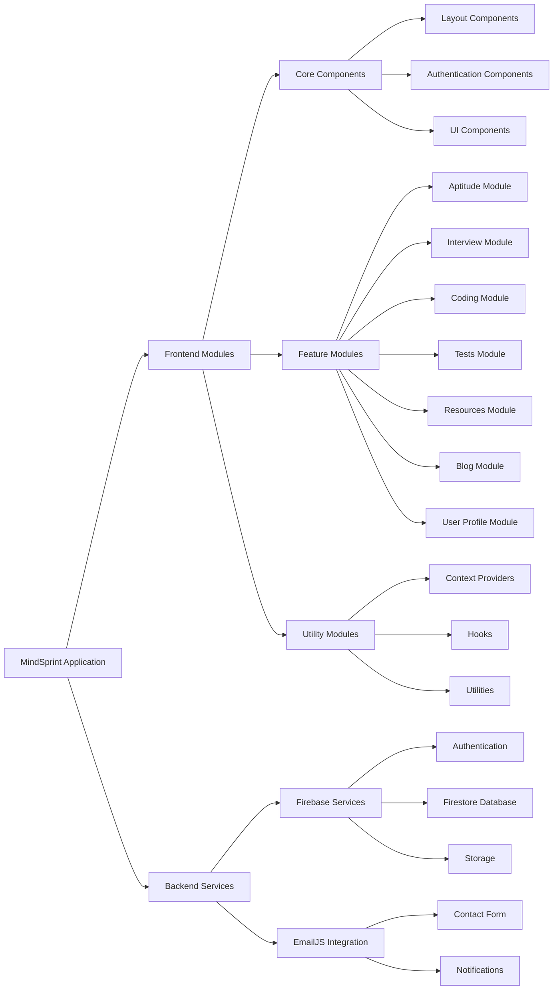

# MindSprint


A comprehensive platform for aptitude development, interview preparation, coding practice, and educational resources.

## Table of Contents

- [Overview](#overview)
- [Features](#features)
- [Tech Stack](#tech-stack)
- [Project Structure](#project-structure)
- [Website Structure](#website-structure)
- [Module Architecture](#module-architecture)
- [Getting Started](#getting-started)
- [Authentication](#authentication)
- [Contact Form](#contact-form)
- [Modules](#modules)
- [Contributing](#contributing)
- [License](#license)

## Overview

MindSprint is a comprehensive educational platform designed to bridge the gap between education and employment. It provides resources for aptitude development, interview preparation, coding practice, and more. The platform aims to empower students and job seekers with the knowledge, skills, and confidence they need to excel in their chosen fields.

## Features

- **User Authentication**: Secure login, signup, and password recovery
- **Aptitude Training**: Comprehensive topic-wise categories for aptitude development
- **Interview Preparation**: Domain-specific technical questions and company-wise interview guides
- **Coding Practice**: Curated coding problems with difficulty levels
- **Mock Tests**: Full-length aptitude and interview MCQ sets with performance tracking
- **Resources**: Downloadable PDFs, career tips, and resume samples
- **Blog**: Articles on technical and soft skills development
- **Contact System**: Email integration for user inquiries
- **Responsive Design**: Fully responsive UI for all device sizes

## Tech Stack

- **Frontend Framework**: Next.js 15.3.3
- **UI Library**: React 19.0.0
- **Styling**: Tailwind CSS 4
- **Authentication**: Firebase Authentication
- **Database**: Firebase Firestore
- **Email Service**: EmailJS
- **Icons**: React Icons
- **Animation**: Framer Motion
- **UI Components**: Headless UI

## Project Structure

```
mindsprint/
├── public/                  # Static assets
│   ├── MindSprint/          # MindSprint specific assets
│   └── mindsprint-logo.svg  # MindSprint logo
├── src/                     # Source code
│   ├── app/                 # Next.js App Router
│   │   ├── about/           # About page
│   │   ├── aptitude/        # Aptitude section
│   │   ├── auth/            # Authentication pages
│   │   ├── blog/            # Blog section
│   │   ├── coding-practice/ # Coding practice section
│   │   ├── contact/         # Contact page
│   │   ├── interview-questions/ # Interview questions section
│   │   ├── mock-tests/      # Mock tests section
│   │   ├── profile/         # User profile page
│   │   ├── resources/       # Resources section
│   │   ├── globals.css      # Global CSS
│   │   └── layout.tsx       # Root layout
│   ├── components/          # React components
│   │   ├── auth/            # Authentication components
│   │   ├── layout/          # Layout components
│   │   └── ui/              # UI components
│   ├── context/             # React context providers
│   └── lib/                 # Utility functions and libraries
└── package.json             # Project dependencies
```

## Website Structure

The following diagram illustrates the overall structure of the MindSprint website:

```mermaid
graph TD
    A[MindSprint Website] --> B[Authentication]
    A --> C[Main Sections]
    A --> D[User Features]
    A --> E[Support]
    
    B --> B1[Login]
    B --> B2[Signup]
    B --> B3[Password Recovery]
    B --> B4[Google Auth]
    
    C --> C1[Aptitude Training]
    C --> C2[Interview Questions]
    C --> C3[Coding Practice]
    C --> C4[Mock Tests]
    C --> C5[Resources]
    C --> C6[Blog]
    
    D --> D1[User Profile]
    D --> D2[Progress Tracking]
    D --> D3[Saved Items]
    
    E --> E1[Contact Form]
    E --> E2[About Page]
    
    C1 --> C1A[Logical Reasoning]
    C1 --> C1B[Quantitative Aptitude]
    C1 --> C1C[Verbal Ability]
    
    C2 --> C2A[Technical Questions]
    C2 --> C2B[HR Questions]
    C2 --> C2C[Company-wise Guides]
    
    C3 --> C3A[Coding Problems]
    C3 --> C3B[CS Topics MCQs]
    
    C4 --> C4A[Aptitude Tests]
    C4 --> C4B[Technical Tests]
    C4 --> C4C[Company-specific Tests]
    
    C5 --> C5A[PDFs]
    C5 --> C5B[Career Tips]
    C5 --> C5C[Resume Samples]
    
    C6 --> C6A[Technical Articles]
    C6 --> C6B[Interview Experiences]
    C6 --> C6C[Career Advice]
```



## Module Architecture

The following diagram illustrates the module architecture of the MindSprint application:



## Getting Started

### Prerequisites

- Node.js 18.0.0 or later
- npm or yarn

### Installation

1. Clone the repository:
   ```bash
   git clone https://github.com/yourusername/mindsprint.git
   cd mindsprint
   ```

2. Install dependencies:
   ```bash
   npm install
   # or
   yarn install
   ```

3. Set up environment variables:
   Create a `.env.local` file in the root directory with your Firebase and EmailJS credentials.

4. Start the development server:
   ```bash
   npm run dev
   # or
   yarn dev
   ```

5. Open [http://localhost:3000](http://localhost:3000) in your browser.

## Authentication

MindSprint uses Firebase Authentication for user management. The following features are implemented:

- Email/Password authentication
- Google Sign-In
- Password recovery
- Protected routes
- User profiles

## Contact Form

The contact form is integrated with EmailJS for sending emails. It includes:

- Form validation
- Error handling
- Success/failure notifications
- Fallback mechanisms for reliability

## Modules

### Aptitude Training
Comprehensive topic-wise categories including logical reasoning, quantitative aptitude, and verbal ability.

### Interview Questions
Domain-specific technical questions, HR questions, behavioral questions, and company-wise interview guides.

### Coding Practice
Curated coding problems with difficulty levels, MCQ-based CS topics, and future online code editor.

### Mock Tests
Full-length aptitude and interview MCQ sets with timer and performance tracking features.

### Resources
Downloadable PDFs, career tips, resume samples, and links to free courses for further learning.

### Blog
Tips for freshers, interview experiences, and articles on technical and soft skills development.

## Contributing

Contributions are welcome! Please feel free to submit a Pull Request.

1. Fork the repository
2. Create your feature branch (`git checkout -b feature/amazing-feature`)
3. Commit your changes (`git commit -m 'Add some amazing feature'`)
4. Push to the branch (`git push origin feature/amazing-feature`)
5. Open a Pull Request

## License

This project is licensed under the MIT License - see the [LICENSE](LICENSE) file for details.
